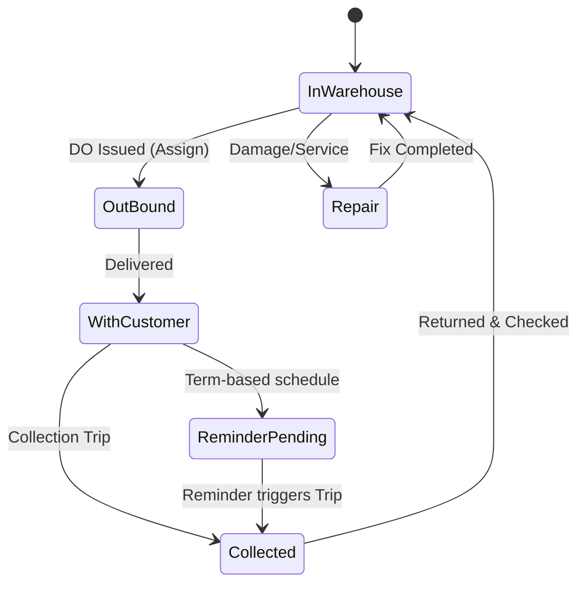
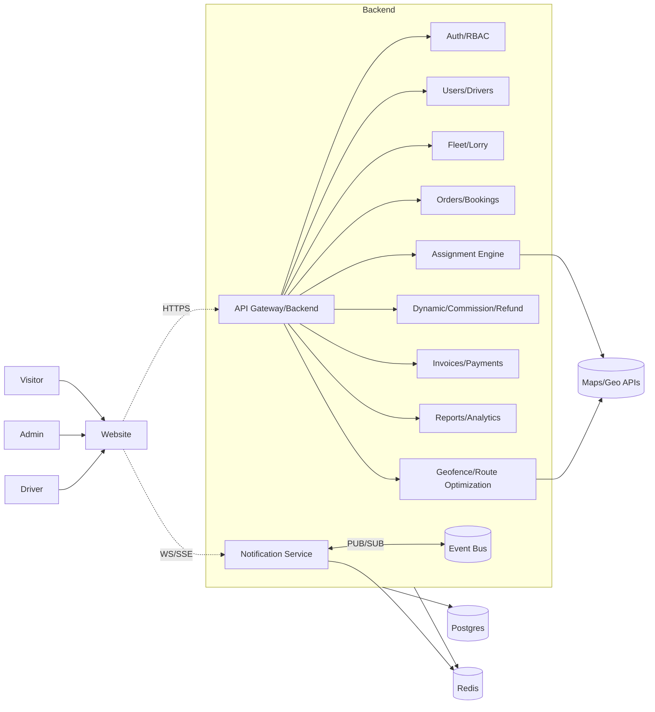
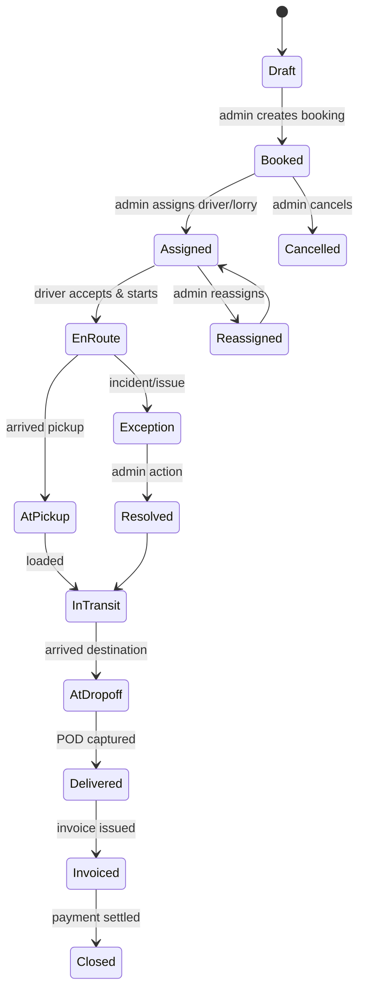
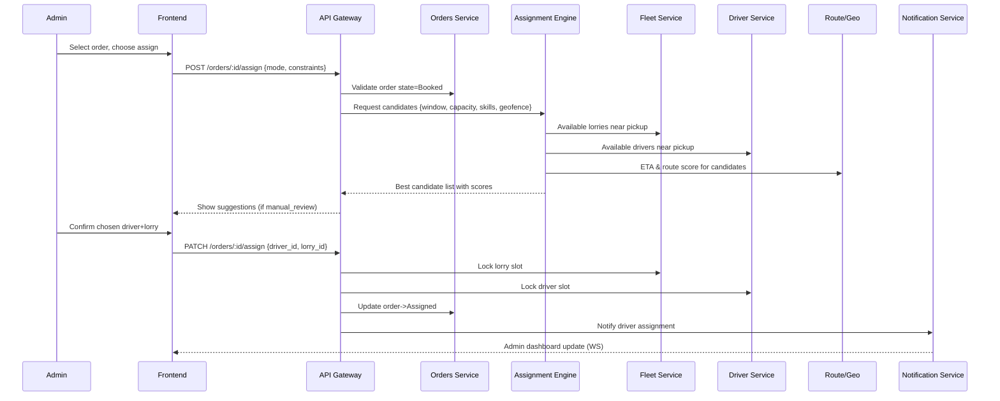
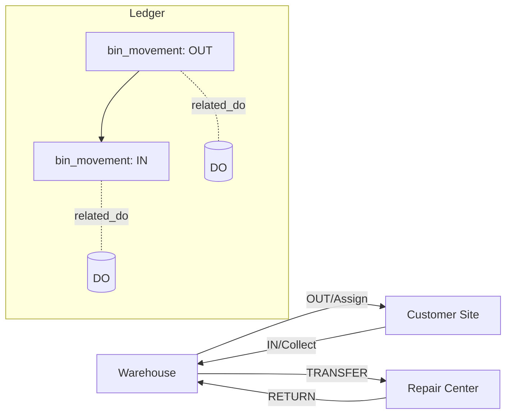
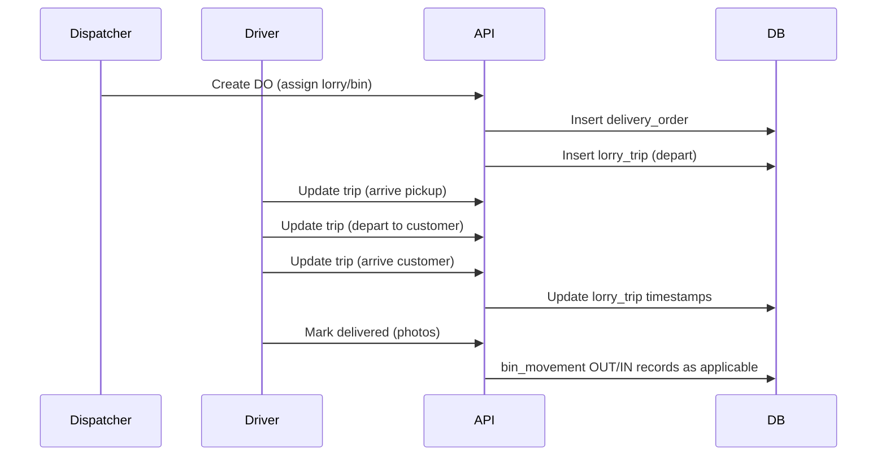
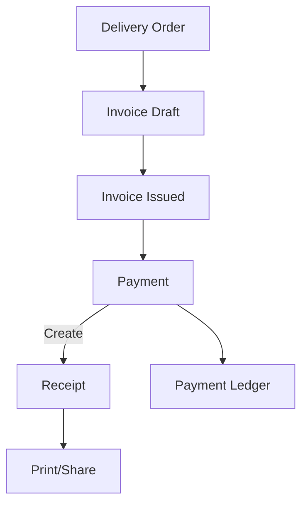
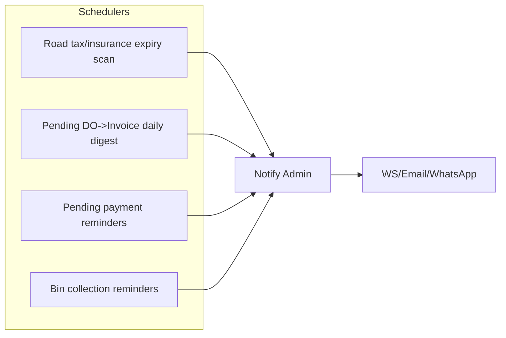

## BIN Management System — Client & Backend Documentation

> Executive summary (for clients)
>
> This website helps Admins and Drivers manage waste collection using BIN/RORO/Dumpster containers. Admins set up company, customers, bins, and lorries; Drivers handle bookings and delivery orders. The system issues invoices, records payments and receipts, reminds for bin collections, and generates clear reports. Everything runs on the website and supports printing A4 or thermal receipts.

### Table of Contents

1. Part A — Client-facing specification
   1. A.1 Scope and purpose
   2. A.2 Company profile
   3. A.3 Customer registry
   4. A.4 Bin inventory (BIN/RORO/Dumpster)
   5. A.5 Lorry records (own and rentable)
   6. A.6 Waste/scrap collection records
   7. A.7 Booking and delivery orders
   8. A.8 Invoice and billing
   9. A.9 Reporting (client-visible list)
2. Part A Flowcharts
   1. Client journey: Booking → DO → Invoice → Payment → Receipt
   2. Bin lifecycle and collection reminders
3. Part B — Backend Developer Documentation
   1. System overview and RBAC
   2. System context diagram
   3. Core domain entities
   4. Data model (schema overview)
   5. API surface (v1)
   6. Events, printing, reporting, security, NFRs
4. Part B Flowcharts
   1. Bin movement ledger
   2. Lorry trip recording
   3. Payments and receipts
   4. Alerts and reminders

This document describes the end-to-end backend architecture, data model, workflows, and API contracts for the BIN Management System so a backend developer can implement and extend the system confidently.

### Part A — Client-facing specification (BIN, RORO, Dumpster)

#### A.0 Feature checklist (client overview)

| Area | Key features |
| --- | --- |
| Company & Users | Admin and Driver roles; website access |
| Customers | Add/search by phone; GST/SST; full contact details |
| Bins (BIN/RORO/Dumpster) | Sizes by feet and cubic yards; unique SN (e.g., ASR 100); status tracking; pricing by size |
| Lorries | Own lorries with road tax/insurance alerts; rentable/third-party lorries |
| Waste Collection | Record items (scrap, trash, etc.); minimum 3 photos per DO |
| Booking & DO | Book by area/state; DO auto-number + manual DO book number; driver can take cash |
| Invoices & Receipts | Auto from DO; search by phone; payment by Cash/Online/CDM/E-wallet/Cheque/Term; receipt per payment |
| Reminders & Alerts | Bin collection reminders; document-expiry alerts |
| Reports | Customers, bins stock/in-out, lorry trips, bookings, DO totals, payments by method, cash vs pending, invoices period sales |
| Printing | A4 invoices/DO; thermal receipts |

#### A.1 Scope and purpose

- Supports BIN, RORO, and Dumpster operations for waste disposal (scrap metal, plastic, bulk trash, construction waste, etc.).
- Covers company profile, customer registry, bin inventory by size/SN, lorry records (own and rentable/third party), waste collection with photos, bookings, delivery orders (DO), invoices/billing, receipts, payments, alerts, and comprehensive reporting.

#### A.2 Company profile

- Stores owner business details: company name, ROC/reg. number, address, postcode, area, state, email, phone.

#### A.3 Customer registry

- Captures: name, address, area, state, phone numbers, email, postcode, company registration number, identity card/passport, GST/SST numbers (if applicable).
- Register and search by mobile phone + company name. Quick search by phone across DO/Invoice screens.

#### A.4 Bin inventory (BIN/RORO/Dumpster)

- Each bin has a unique serial number (e.g., ASR 100, LSR 150) and a size in feet (H x L x W). Supports many sizes; sample dumpster sizes:

| Dumpster Size | Approx. Weight | Standard Dimensions | Total Volume |
| --- | --- | --- | --- |
| 4 Yard | 1,500 lbs | 10 ft x 2 ft x 5.5 ft | 4 yd³ |
| 6 Yard | 1,700 lbs | 10 ft x 3 ft x 5.5 ft | 6 yd³ |
| 10 Yard | 2,220 lbs | 10 ft x 4 ft x 7 ft | 10 yd³ |
| 15 Yard | 2,620 lbs | 11 ft x 4.5 ft x 8 ft | 14.8 yd³ |
| 20 Yard | 3,040 lbs | 11 ft x 6 ft x 8 ft | 20 yd³ |

- Track status: in-warehouse, assigned, with-customer, collected, repair.
- Area/state tagging for planning; price can vary by size.

#### A.5 Lorry records (own and rentable)

- Own lorry: model, ton, plate number, driver assignment, road tax/insurance expiry with auto alerts before expiry.
- Rentable/third-party lorry and drivers: name, lorry number, operating area, available bins.

#### A.6 Waste/scrap collection records

- Define items: scrap, trash, construction, etc.
- Each DO collects a set of items with minimum 3 photos (evidence).

#### A.7 Booking and delivery orders

- Booking created by lorry driver or staff; chosen by state and area.
- DO can be issued by client name or phone number.
- System generates auto DO number; driver can input manual DO book number (from physical book).
- Payment can be taken at DO time by driver (cash/online/CDM/e-wallet/cheque/term). A receipt is issued immediately for any payment received.
- After delivering a bin, the system auto prompts collection reminders to Admin and the assigned Driver; supports same-day or term-based collections.

#### A.8 Invoice and billing

- Invoices are auto-created from DOs. Invoice includes the linked DO number. Invoice lookup by phone number supported.
- Admin issues invoices and can send via email or WhatsApp.
- Payment terms: cash, online transfer, CDM, e-wallet, cheque, term.
- Receipt issuance: on each payment, a receipt is generated for the customer.

#### A.9 Reporting (client-visible list)
#### A.10 Simple step-by-step examples

1) Add a new customer
- Admin goes to Customers → Add → fills name, phone, address, GST/SST if any → Save.

2) Add a bin
- Admin goes to Bins → Add → enters SN (e.g., ASR 100), size (H×L×W), price → Save.

3) Create booking and issue DO
- Driver opens Bookings → New → chooses area/state and bin size → Submit.
- Admin assigns lorry and bin → Issue DO (auto number + optional manual DO book number).
- Driver collects payment (if cash) → system issues receipt.

4) Invoice and payment
- Admin opens pending DOs → Create Invoice → Send by email/WhatsApp.
- Customer pays (cash/online/CDM/e-wallet/cheque) → system records payment and issues receipt.

5) Bin collection
- System reminds Admin and Driver on due date → Driver collects bin → status updates to In Warehouse.

#### A.11 FAQ (for clients)

- Can drivers take cash and get a receipt? Yes, a receipt is issued immediately.
- Can we search invoices by phone? Yes, via invoice search.
- Do we support different dumpster sizes? Yes, multiple sizes with cubic yards.
- Can we use our manual DO book? Yes, enter the manual DO number; the system also assigns its own DO number.
- Will we be reminded to collect bins? Yes, same-day or term reminders.
- Is there a mobile app? Not required; website-only.

#### A.12 Glossary

- DO (Delivery Order): Document that records bin delivery with details and payment (if any).
- SN (Serial Number): Unique ID on each bin (e.g., ASR 100).
- CDM: Cash Deposit Machine payment.
- RORO: Roll-on/Roll-off type of dumpster.

### Part A Flowcharts

#### Client journey: Booking → DO → Invoice → Payment → Receipt

```mermaid
flowchart TD
  A[Customer request / Booking] --> B[Create Booking (Area/State, Size)]
  B --> C[Assign Driver & Lorry]
  C --> D[Issue Delivery Order]
  D -->|Optional immediate| P1[Payment at DO (Driver)]
  D --> E[Deliver Bin]
  E --> F[Collection Reminder Scheduled]
  D --> G[Auto-create Invoice Draft]
  G --> H[Owner/Manager Issues Invoice]
  P1 --> R1[Receipt Issued]
  H --> P2[Customer Payment]
  P2 --> R2[Receipt Issued]
  E --> C1{Same-day or Term Collection?}
  C1 -->|Same-day| K1[Collect Bin]
  C1 -->|Term| K2[Remind & Collect Later]
  K1 --> L[Close DO/Invoice]
  K2 --> L
```

#### Bin lifecycle and collection reminders



- Customers: customer details, area-wise customer list, phone search.
- Bin inventory: stock on hand by SN; bin in/out by SN; area-wise bin out.
- Lorry: lorry in/out; lorry with bin in/out; every lorry trip by lorry number and driver name.
- Rentable lorry: third-party usage with bins.
- Items: detail report for item in/out.
- Bookings: day/week/month/year; total DO out per day; payments received by method; cash received and balance pending per DO; DO by driver name.
- Invoices: daily/weekly/monthly/yearly sales; pending payment alerts; by client paid/pending; area-wise received/pending; received by method (cash/online/CDM/e-wallet/cheque); bin trip sales by SN.

---

### Part B — Backend Developer Documentation

### 1) System overview

- Purpose: Manage BIN inventory, orders, delivery operations, invoicing, commissions, refunds, expenses, and reporting for a waste collection/logistics company.
- Primary actors:
  - Admin: Full control; can add client details, issue/edit DO, issue invoices
  - Driver: add client details, book bins, issue temporary DO, update statuses, collect payments
- Channels:
  - Web app (admin/manager)
  - Mobile app (driver/supervisor)
  - Printing: A4 and thermal receipt

### 2) RBAC and access levels

- Admin
  - Full access to all entities and actions
  - Issue invoices and edit them
  - Configure commissions, refund approvals, edit DOs, finalize payments
  - Manage orders, DOs, assignments, drivers, clients
  - Can add client details and issue DO (as per policy)
- Driver
  - Create booking bins, issue temporary DO entries from DO book
  - Choose any lorry (policy-bound), pick/return bins, upload 3 photos for waste items, collect cash, update order status and basic client details

Authentication: JWT with role claims. Authorization: route/method scope per role.

### 3) System context diagram



### 4) Core domain entities

- Business
  - Company profile: name, ROC, address, email, phone, area, state
- Customer
  - Company name, ROC, contact person, IC/passport, addresses, postcode, area, state, email, phone
  - Tax: GST/SST numbers where applicable
  - Registered by mobile number + company name
  - Notes for special instructions
- Lorry
  - Model, plate number, tonnage, documents: road tax, insurance, expiry dates, auto-renew alerts
  - Status: available, assigned, maintenance
- RentableLorry
  - External providers: name, lorry number, coverage area, bin numbers, rentable flag
- InventoryBin
  - Serial number formats: ASR 100 / LASR 100 / PWD 100 (alpha+number)
  - Dimensions: size in ft (H x L x W); store cubic yards derived where relevant
  - Open price by size; status: in_warehouse, assigned, with_customer, repair
- WasteItem
  - Catalog of collectible item types (scrap, trash, construction, etc.)
  - Each DO can attach up to 3 pictures
- Driver
  - Driver name, IC, phone, address, availability, current location (optional)
- Booking
  - Created by driver or staff; references desired bin size, area/state, schedule
- DeliveryOrder (DO)
  - Issued by driver or office; fields: DO by Name, company, phone, DO book number (manual entry), bin SN, size, payment type (Cash/Online/Cheque/CDM/Term), amount, weight (kg)
  - Source: bin from warehouse or customer place
  - Pending DO auto-pop-up to convert into invoice and process payments
  - Owner can edit DO
- Invoice
  - Auto-issued from DO; owner-only issuance and editable
  - Convert to PDF; track payment status; pending payments auto surfaced
- Commission
  - For introducer after invoice and client payment
  - Commission by amount only (not percentage)
- Refund
  - Tied to DO or Invoice with reasons; cancel job handling uses same flow
- Expense
  - Company-related expenses; reporting only; not tallied against revenue in this system’s financials
  - Optional categories: salary, advance salary, lorry repair, petrol, bin repair expenses
- Attachments
  - Photos for waste items, documents for lorries, proof of delivery
- AuditLog
  - Who changed what and when (critical for DO, Invoice, Refund, Commission)

### 5) Identifiers and numbering

- DO book number: manual entry from physical book; must be unique per book series
- Bin serial numbers: enforce pattern (ASR|LASR|PWD) + sequence
- Invoice number: system-generated with prefix + year + sequence
- Customer registration: indexed by mobile number + company name

### 6) Lifecycles and states

- Delivery Order (DO)
  - Draft → Issued → PendingInvoice → InvoicedLinked → Closed
  - Cancelled (side track) with reason and optional refund reference
- Invoice
  - Draft → Issued → PartiallyPaid → Paid → Closed
  - Voided (if owner voids)
- Commission
  - Eligible (after Paid) → Approved → Paid
- Refund
  - Requested → Approved → Processed → Reconciled
- Bin
  - InWarehouse → Assigned → WithCustomer → Collected → Repair → InWarehouse

### 7) Admin-centric workflow (swimlanes)

```mermaid
flowchart LR
  subgraph Admin
    A1[Create Booking/Order] --> A2[Set pricing/rules]
    A2 --> A3[Choose assignment mode]
    A3 -->|Auto| A4[Review suggested driver+lorry]
    A3 -->|Manual| A5[Pick driver & lorry]
    A4 --> A6[Confirm assignment]
    A5 --> A6
    A6 --> A7[Track status live]
    A7 --> A8[Handle exceptions/refunds]
    A8 --> A9[Invoice/close order]
  end

  subgraph System
    S1[Validate data] --> S2[Price compute]
    S2 --> S3[Persist draft order]
    S3 --> S4[Auto-assignment (if chosen)]
    S4 --> S5[Lock driver+lorry capacity]
    S5 --> S6[Notify driver]
    S6 --> S7[Emit events, dashboards update]
    S7 --> S8[Realtime tracking, SLA checks]
    S8 --> S9[Trigger invoicing/commission]
  end

  A1 -.-> S1
  A2 -.-> S2
  A3 -.-> S4
  A6 -.-> S5
  S6 -.-> A7
  A8 -.-> S9
  S9 -.-> A9
```

### 8) Order lifecycle (state machine)



### 9) Assignment flow (sequence)



### 10) Data model (ER overview)

- Business(1) — Customer(*)
- Customer(1) — DeliveryOrder(*)
- DeliveryOrder(1) — Invoice(0..1)
- DeliveryOrder(1) — Commission(0..1)
- Invoice(1) — Refund(*)
- Driver(1) — DeliveryOrder(*)
- Lorry(1) — DeliveryOrder(*)
- RentableLorry separate for external jobs
- InventoryBin(1) — DeliveryOrder(*)
- WasteItem(*) — DeliveryOrder(*) via DOItems
- Expense(*) linked to Business or general ledger bucket
- Attachment(*) polymorphic (DO, Invoice, Lorry)

### 11) Suggested relational schema (columns abbreviated)

- business
  - id, name, roc_number, address, postcode, area, state, email, phone, created_at, updated_at
- customer
  - id, business_id, company_name, roc_number, gst_no, sst_no, contact_name, id_number, passport, email, phone, address, postcode, area, state, notes, created_at, updated_at
  - unique (phone, company_name)
- driver
  - id, name, ic_number, phone, address, status, created_at, updated_at
- lorry
  - id, model, plate_number, tonnage, status, road_tax_expiry, insurance_expiry, created_at, updated_at
- rentable_lorry
  - id, provider_name, lorry_number, area, bin_numbers, rentable_flag, created_at, updated_at
- inventory_bin
  - id, serial_number, size_h_ft, size_l_ft, size_w_ft, cubic_yards, approx_weight_lbs, open_price, status, area, state, location, created_at, updated_at
  - unique (serial_number)
- waste_item
  - id, name, active
- booking
  - id, customer_id, requested_bin_size_h_l_w_ft, area, state, scheduled_at, status, created_by_user_id, created_at, updated_at
- delivery_order
  - id, customer_id, driver_id, lorry_id, inventory_bin_id, source_location_type, do_by_name, company_name, phone, do_book_number, system_do_number, bin_size_h_l_w_ft, payment_method, amount, weight_kg, status, issued_at, created_by_user_id, created_at, updated_at
  - unique (do_book_number) per series if applicable
- delivery_order_item
  - id, delivery_order_id, waste_item_id, description, quantity, unit, price
- invoice
  - id, delivery_order_id, invoice_number, status, subtotal, tax, tax_code, total, issued_by_user_id, issued_at, updated_at
  - unique (invoice_number)
- payment
  - id, invoice_id, method {CASH|ONLINE|CDM|EWALLET|CHEQUE|TERM}, amount, received_by_user_id, received_at, reference, receipt_number
- commission
  - id, delivery_order_id, introducer_name, amount, status, paid_at
- refund
  - id, target_type {DO|INVOICE}, target_id, reason, amount, status, processed_at, approved_by_user_id
- expense
  - id, category, description, amount, expense_date, created_by_user_id, created_at
 - bin_movement
  - id, inventory_bin_id, movement_type {OUT|IN|TRANSFER|REPAIR}, related_do_id, area, state, moved_at, notes
 - lorry_trip
  - id, lorry_id, driver_id, from_location, to_location, inventory_bin_id, related_do_id, departed_at, arrived_at, notes
- attachment
  - id, target_type {DO|INVOICE|LORRY}, target_id, url, type {photo|doc}, created_at
- audit_log
  - id, actor_user_id, entity_type, entity_id, action, before_json, after_json, created_at
- user
  - id, email, password_hash, role {ADMIN|MANAGER|SUPERVISOR|DRIVER}, active, created_at, updated_at

Indexes: by foreign keys, dates for reporting, and by phone/company for customer lookup.

### 12) API surface (v1)

- Auth
  - POST /auth/login, POST /auth/refresh, POST /auth/logout, GET /me
- Business
  - GET /business, PATCH /business
- Customers
  - GET /customers, POST /customers, GET /customers/:id, PATCH /customers/:id
- Drivers
  - GET /drivers, POST /drivers, GET /drivers/:id, PATCH /drivers/:id
- Lorries
  - GET /lorries, POST /lorries, GET /lorries/:id, PATCH /lorries/:id
  - GET /lorries/alerts?withinDays=30 (road tax/insurance expiry)
- Rentable Lorries
  - GET /rentable-lorries, POST /rentable-lorries, PATCH /rentable-lorries/:id
- Inventory Bins
  - GET /bins, POST /bins, GET /bins/:id, PATCH /bins/:id
  - GET /bins/:id/movements, POST /bins/:id/movements
- Waste Items
  - GET /waste-items, POST /waste-items, PATCH /waste-items/:id
- Bookings
  - GET /bookings, POST /bookings, PATCH /bookings/:id
- Delivery Orders
  - GET /delivery-orders?status=&customer_id=&date=
  - POST /delivery-orders
  - GET /delivery-orders/:id
  - PATCH /delivery-orders/:id
  - POST /delivery-orders/:id/issue
  - POST /delivery-orders/:id/cancel
  - POST /delivery-orders/:id/attach (photos)
  - POST /delivery-orders/:id/receipt (issue receipt for any payment)
  - POST /delivery-orders/:id/collection-reminder (trigger reminders)
- Invoices
  - GET /invoices?status=&customer_id=&date=
  - POST /invoices/from-do/:deliveryOrderId
  - GET /invoices/:id
  - PATCH /invoices/:id
  - POST /invoices/:id/issue
  - POST /invoices/:id/payments
  - POST /invoices/:id/void
  - GET /invoices/:id/pdf
  - GET /invoices/search?phone=
- Commissions
  - GET /commissions?status=
  - POST /commissions/:deliveryOrderId/approve
  - POST /commissions/:id/pay
- Refunds
  - GET /refunds
  - POST /refunds (target_type, target_id, reason, amount)
  - POST /refunds/:id/approve
  - POST /refunds/:id/process
- Expenses
  - GET /expenses, POST /expenses
- Attachments
  - GET /attachments?target_type=&target_id=
- Reports
  - GET /reports/summary?from=&to=
  - GET /reports/customers
  - GET /reports/inventory
  - GET /reports/bins/stock-on-hand
  - GET /reports/bins/inout-by-sn
  - GET /reports/bins/area-out
  - GET /reports/lorries
  - GET /reports/lorries/trips
  - GET /reports/rentable-lorries
  - GET /reports/items
  - GET /reports/drivers
  - GET /reports/bookings
  - GET /reports/delivery-orders
  - GET /reports/delivery-orders/daily-totals
  - GET /reports/delivery-orders/payments-by-method
  - GET /reports/delivery-orders/cash-vs-pending
  - GET /reports/delivery-orders/by-driver
  - GET /reports/invoices
  - GET /reports/invoices/period-sales
  - GET /reports/invoices/pending-alerts
  - GET /reports/invoices/by-client-paid
  - GET /reports/invoices/by-client-pending
  - GET /reports/invoices/area-wise
  - GET /reports/invoices/by-method
  - GET /reports/bin-trip-sales-by-sn
  - GET /reports/commissions
  - GET /reports/refunds
  - GET /reports/cancelled
  - GET /reports/expenses
- Printing
  - GET /print/do/:id?a4=true|false
  - GET /print/invoice/:id?a4=true|false
  - GET /print/receipt/:paymentId?a4=false

Notes:
- Owner-only endpoints enforced for invoice issue/edit/void.
- Driver-access endpoints guarded and limited to their own DOs and actions.

### 13) Assignment and operational rules

- Admin can assign any order/DO to a driver and lorry; drivers may select a lorry when issuing a DO (if allowed by policy)
- Validate BIN availability and lock during DO issuance
- For rentable lorry usage, mark source as external and log provider details
- Geographical filters for booking and dispatch by area/state
- Payment types must be constrained and logged; cash received by driver tracked per DO and per user

### 14) Validation rules (non-exhaustive)

- Unique constraints: bin serial, invoice number, DO book number (per series)
- DO must include: customer, bin SN, size, payment type, amount
- Invoice creation only from DO in PendingInvoice or Issued state
- Commission only after invoice Paid
- Refund amount cannot exceed total paid for target
- Lorry documents must include expiry dates; alerts trigger prior to expiry
- Up to 3 photos per DO waste item set

### 15) Events and notifications

- Events
  - customer.created, bin.added, lorry.updated, do.issued, do.cancelled
  - invoice.issued, invoice.paid, invoice.voided
  - commission.approved, commission.paid
  - refund.requested, refund.approved, refund.processed
  - lorry.alert.expiring_document
- Subscriptions
  - Admin dashboards subscribe to operational events
  - Drivers receive assigned DOs and payment confirmations
  - Collection reminders to Owner/Manager and assigned Driver
- Transport
  - WebSocket/SSE, backed by Redis pub/sub or message queue
  - Email/WhatsApp integration for invoice/receipt and alerts (optional)

### 16) Printing

- A4: full DO and Invoice templates with company header, customer details, bin info, amounts, signatures, QR of invoice/DO link
- Thermal: compact receipt with essential fields, DO/Invoice number, date/time, payment method, amounts
- Rendering: server-generated PDFs and printer-friendly HTML

### 17) Reporting

- Standard reports (filters by date range, area, state, status)
  - Customers, Inventory bins, Lorries, Rentable lorries, Items
  - Drivers, Bookings, Delivery Orders, Invoices
  - Commissions, Refunds, Cancelled jobs
  - Expenses (view only, not tallied)
  - DO daily totals, payments by method, cash vs pending, DOs by driver
  - Bin stock on hand by SN, bin in/out by SN, area-wise bin out
  - Lorry trips and lorry+bin trip detail
  - Invoice period sales (daily/weekly/monthly/yearly), pending alerts, area-wise, by method
- Exports: CSV/PDF

### Part B Flowcharts

#### Bin movement ledger



#### Lorry trip recording



#### Payments and receipts



#### Alerts and reminders



### 18) Security and compliance

- Authentication: JWT, refresh tokens, password hashing (argon2/bcrypt)
- Authorization: role-based guards and per-resource ownership checks
- Auditing: capture before/after JSON for DO, Invoice, Refund, Commission
- Input validation: schema-based (e.g., Zod/Joi)
- File uploads: virus scan optional; storage to S3-compatible bucket with signed URLs
- PII: limit exposure, mask IC/passport in logs

### 19) Non-functional requirements

- Reliability: transactional integrity for DO→Invoice; idempotent endpoints for DO issue and payments
- Scalability: caches for read-heavy lists; queue for printing and alerts
- Observability: structured logs, metrics for DO/Invoice throughput, error rates
- Backups: nightly DB backups; retention policy
- Timezone: consistent storage in UTC

### 20) Technology recommendations

- Backend: NestJS or Express + TypeScript
- DB: PostgreSQL; ORM: Prisma
- Cache/Queue: Redis (pub/sub and delayed jobs)
- Auth: JWT + RBAC
- Files: S3-compatible object storage
- PDF: server-side HTML-to-PDF (e.g., Playwright)
- Realtime: WebSocket gateway with Redis adapter

### 21) Example API contracts

- Create Delivery Order
```http
POST /v1/delivery-orders
Content-Type: application/json

{
  "customer_id": "uuid",
  "driver_id": "uuid",
  "lorry_id": "uuid",
  "inventory_bin_id": "uuid",
  "do_by_name": "string",
  "company_name": "string",
  "phone": "string",
  "do_book_number": "AS-2025-00123",
  "bin_size": { "h_ft": 4, "l_ft": 12, "w_ft": 6 },
  "payment_method": "CASH",
  "amount": 350.00,
  "weight_kg": 1200,
  "source_location_type": "WAREHOUSE",
  "waste_items": [
    { "waste_item_id": "uuid", "description": "Construction debris", "quantity": 1, "unit": "load", "price": 350.00 }
  ]
}
```

- Issue Invoice from DO
```http
POST /v1/invoices/from-do/DO_UUID
```

- Record Payment
```http
POST /v1/invoices/INV_UUID/payments
{
  "method": "CASH",
  "amount": 350.00,
  "reference": "Driver cash drop 2025-09-12"
}
```

- Approve Commission
```http
POST /v1/commissions/DO_UUID/approve
{
  "amount": 50.00,
  "introducer_name": "John Referrer"
}
```

- Request Refund
```http
POST /v1/refunds
{
  "target_type": "INVOICE",
  "target_id": "INV_UUID",
  "reason": "Overcharge",
  "amount": 50.00
}
```

### 22) Background jobs and alerts

- Lorry document expiry alerts: run daily; notify admin if within N days
- Pending DOs without invoices: daily digest
- Pending payments: reminders by age
- Commission eligibility scanner: when invoices become Paid
- Cleanup orphaned bin assignments and stale locks

### 23) Environment and configuration

- env vars
  - DATABASE_URL, REDIS_URL
  - JWT_SECRET, JWT_EXPIRES_IN, REFRESH_EXPIRES_IN
  - STORAGE_ENDPOINT, STORAGE_BUCKET, STORAGE_ACCESS_KEY, STORAGE_SECRET_KEY
  - PDF_RENDERER_URL (if remote)
  - BASE_URL for links/QRs
- secrets: use vault or platform secrets
- config per environment: dev, staging, prod

### 24) Data seeding

- Business: base company record
- Reference: waste items catalog
- Drivers: few demo drivers
- Lorries: sample with upcoming expiries
- Bins: several sizes and SN formats
- Customers: sample with different areas/states

### 25) Open policy points to confirm

- Can drivers choose any lorry always, or require manager override?
- Is DO book number uniqueness enforced globally or per physical book series?
- Commission approval workflow: auto vs manual?
- Refund approval: who can approve (owner/admin only)?
- Payment reconciliation: cash collected by drivers—do we track driver cash ledger?


